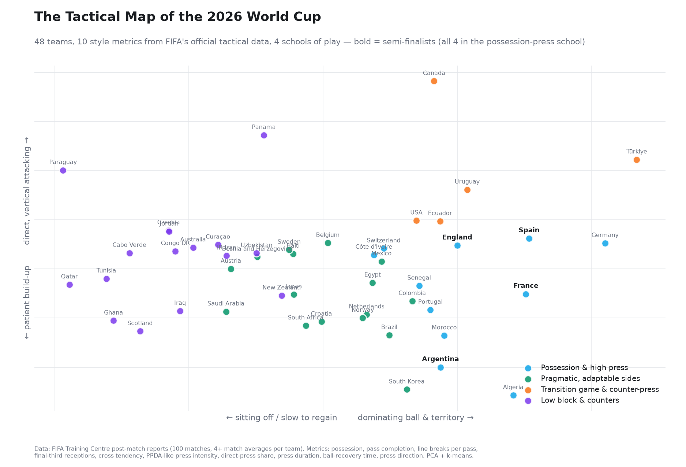
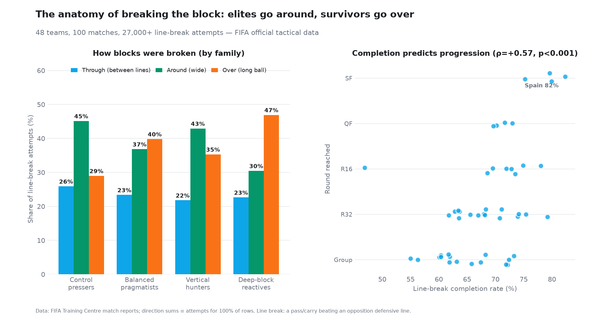
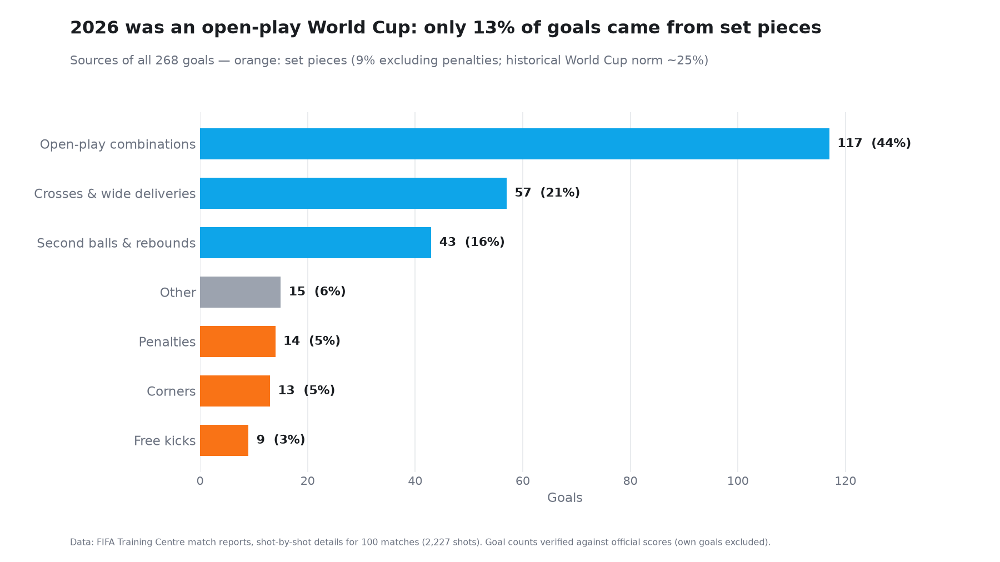

# Tactical DNA of the 2026 World Cup

*2026 Dünya Kupası'nın taktik haritası: FIFA'nın resmî taktik verisiyle 48 takımın oyun stili.*

FIFA publishes a ~50-page post-match report for every 2026 World Cup match,
full of tactical metrics that exist in no public dataset: pressing duration,
ball-recovery time, line breaks by direction, defensive block heights,
receptions in the final third. The numbers are embedded with an obfuscated
font that defeats standard PDF extraction — this project decodes them
(validated at 100%) and asks: **how did the 48 teams actually play, and
which styles worked?**

Companion project: [wc2026-climate-analysis](https://github.com/CeyhunOzcorapsiz/wc2026-climate-analysis)
(same PDF corpus, same decode method).

## The tactical map

10 style features (possession, directness, verticality, cross tendency,
PPDA-like pressing intensity, press duration/direction, recovery time…)
→ z-scores → PCA + k-means over 100 matches:



🎬 **Animated version:** the map builds itself school by school in a
~37 s data story — [English](output/tactical_map_story_en.mp4) ·
[Turkish](output/tactical_map_story_tr.mp4).

Four families emerged. All four semi-finalists (Spain, France, England,
Argentina) sit in the **control-and-press** family, whose average run was
two rounds deeper than the reactive family's. Türkiye lands in the small
**vertical hunters** family — the tournament's most aggressive direct
pressers alongside Canada, the USA and Uruguay.

## Key findings

**Breaking the block: accuracy is the strongest style-success signal.**
Line-break *completion rate* correlates with tournament progression at
ρ = +0.57 (p < 0.001, n = 48) — stronger than any single style choice.
And the anatomy differs: elite teams go *around* defensive lines (45% of
attempts), reactive teams go *over* them with long balls (47%).



**2026 was an open-play World Cup.** Only 13% of goals came from set
pieces (9% excluding penalties) — far below the ~25% historical World Cup
norm. The USA were the outlier, scoring 43% of their goals from set pieces.



*Turkish versions of all figures are in [`output/`](output/).*

**The goalkeeper paradox.** Teams whose goalkeeper attempted more line
breaks went *less* deep (ρ = −0.31, p = 0.031). High keeper involvement
mostly reflects long clearances under pressure (Paraguay: 22.6 attempts
per match), not modern build-up play; elite keepers contribute rarely but
efficiently (Brazil: 6.8).

**The underdog recipe.** In the 92 matches with a ≥50 Elo gap, underdogs
who took points recovered the ball ~2 s faster (17.5 vs 19.3 s, p = 0.025)
and crossed less (p = 0.023) than underdogs who lost.

**Knockout football is different.** Within the same 32 teams, knockout
matches showed −3.9 pp possession, +45 pressures and +1.9 s recovery time
versus their group games (paired tests, p < 0.05) — partly tougher
opponents, partly a real shift to transition football.

**No fatigue signature.** Per-team match order shows *rising* distance and
pressure counts as the tournament progresses — and heat does not reduce
pressing metrics either (all p > 0.1), which answers a question raised in
the climate project: the heat-driven collapse in shot conversion is not
explained by teams pressing less.

## Data & verification

| Layer | Check | Result |
|---|---|---|
| Obfuscated digits | zone/direction sums ≡ totals | 100% (3,159 + 3,159 rows) |
| Match identity | header date + team pair vs schedule | 100/100 matched |
| Goals | parsed vs official scores | 100% agreement |
| Shots | 2,227 shots, 268 goals | consistent with official totals |

Findings with insufficient sample sizes (e.g. family-vs-family match-up
cells with <10 matches) are deliberately excluded. See
[METHODOLOGY.md](METHODOLOGY.md).

## Repo layout & reproduce

```
scripts/
  parse_tactical.py    # Key Statistics + Defensive Pressure pages → CSV
  parse_details.py     # per-player line breaks + shot-by-shot details
  cluster_teams.py     # style features → PCA + k-means
  findings.py          # findings 1-7 (style vs results)
  findings_8_10.py     # GK build-up, set pieces, line-break anatomy
  make_map.py / make_finding_figs.py
data/    # generated CSVs
output/  # figures
```

```bash
pip install -r requirements.txt
# PDF'ler icin: klon yaninda wc2026-climate-analysis/data/fifa_reports gerekli
python scripts/parse_tactical.py && python scripts/parse_details.py
python scripts/cluster_teams.py && python scripts/findings.py && python scripts/findings_8_10.py
```

## Limitations

- 48 teams / 100 matches; team-level correlations have modest power.
- Full-match aggregates: game-state effects (leading teams defend more)
  confound style-vs-result associations; flagged where relevant.
- k = 4 families chosen for interpretability (silhouette favours the
  coarser k = 2 "control vs reactive" split, which is reported as the
  primary axis).
- Semi-finals and final pending at time of analysis.
